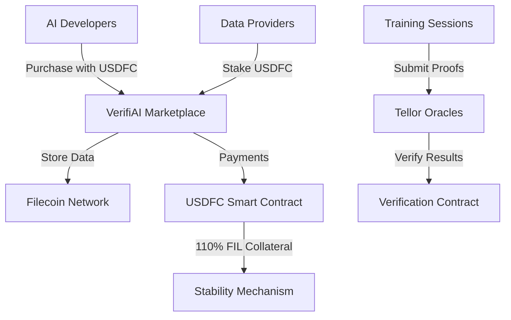

# VerifiAI: Verifiable AI Training Data Marketplace

> **Protocol Labs Genesis Hackathon 2025 - Fresh Code Challenge**  
> **Transforming AI Training with Cryptographic Verification on Filecoin**

VerifiAI is the first verifiable AI training data marketplace built on Filecoin with **USDFC payments**, enabling cryptographically proven AI model training using Tellor oracles and F3 fast finality.

## 🌟 **Why USDFC Over WFIL?**

We've **upgraded from WFIL to USDFC** because:

### ✅ **USDFC is LIVE and Production-Ready**
- **Real stablecoin** launched by Secured Finance in March 2025
- **USD-pegged**: No price volatility for data marketplace payments
- **110% FIL collateralized**: Maintains stability while staying native to Filecoin
- **Growing adoption**: SushiSwap trading, Lighthouse storage payments, lending markets

### ✅ **Perfect for AI Data Markets**
- **Stable pricing**: Data providers can price datasets in USD without volatility risk
- **Cross-chain bridges**: Easy integration with other DeFi ecosystems via Axelar
- **Real utility**: Already accepted by Lighthouse for storage fees
- **Native to Filecoin**: Built specifically for the Filecoin ecosystem

### 📊 **USDFC Adoption Stats (Real Data)**
- SushiSwap volume: **>100k USD per week**
- Cumulative lending volume: **>250k USD**
- USDFC APR: **8-10%** against iFIL/pFIL collateral

## 🚀 **Core Innovation**

### **Verifiable AI Training with Cryptographic Proofs**
- **Tellor Oracles**: Custom queries verify model performance and training data usage
- **USDFC Payments**: Stable, reliable payments for AI training data
- **F3 Fast Finality**: 450x faster transaction finality (minutes vs hours)
- **Immutable Proof Chain**: End-to-end verification from data purchase to model training

## 🏗️ **Architecture**



## 💰 **USDFC Integration Benefits**

### **For Data Providers**
- **Stable earnings**: Get paid in USD-pegged tokens, not volatile FIL
- **Instant liquidity**: Convert USDFC to other assets via SushiSwap
- **Collateral yield**: Earn ~10% on FIL collateral backing USDFC

### **For AI Developers**
- **Predictable costs**: Budget AI training in stable USD terms
- **No slippage**: Mint USDFC directly with FIL, redeem anytime
- **Cross-chain access**: Bridge USDFC to other chains for additional DeFi strategies

### **For the Ecosystem**
- **Price stability**: USDFC helps moderate FIL price swings
- **Capital efficiency**: 110% collateral ratio vs 100% backing
- **Real adoption**: Built on proven architecture with active users

## 🔧 **Smart Contracts**

### **Core Contracts (USDFC-Powered)**
- **VerifiAIMarketplace**: Data listing, purchasing, provider staking with USDFC
- **VerifiAIVerification**: AI training verification using Tellor oracles  
- **VerifiAIPayments**: USDFC payment processing and escrow
- **USDFC Token**: Mock implementation for testnet (real USDFC on mainnet)

### **Deployment Addresses (Calibration Testnet)**
```bash
# Deploy with USDFC
yarn deploy:calibration

# Contract addresses will be updated after deployment
USDFC Token: 0x...
VerifiAI Marketplace: 0x...
VerifiAI Verification: 0x...
VerifiAI Payments: 0x...
```

## 🎯 **Getting Started**

### **1. For Data Providers**
```javascript
// Stake USDFC to become a provider
await marketplace.stakeAsProvider(ethers.utils.parseEther("100")); // 100 USDFC

// List your dataset
await marketplace.listDataset(
  "ipfs://QmYourDatasetHash", 
  ethers.utils.parseEther("10"), // 10 USDFC per batch
  dealId
);
```

### **2. For AI Developers**
```javascript
// Purchase training data with USDFC
await usdfc.approve(marketplace.address, purchaseAmount);
await marketplace.purchaseData(datasetId, batchCount);

// Submit training results for verification
await verification.submitTraining(
  datasetId,
  modelHash,
  datasetHash,
  modelType,
  metrics
);
```

### **3. Getting USDFC (Testnet)**
```javascript
// Option 1: Mint with FIL collateral (like real USDFC)
await usdfc.mintWithCollateral({ value: ethers.utils.parseEther("1") });

// Option 2: Direct mint for testing
await usdfc.mint(userAddress, ethers.utils.parseEther("1000"));
```

## 🔮 **Why Tellor Oracles?**

- **Custom AI Queries**: Purpose-built verification for model performance
- **Decentralized**: No single point of failure in verification
- **Crypto-Economic Security**: Staked validators ensure honest reporting
- **Filecoin Native**: Optimized for Filecoin ecosystem

## 🏆 **Hackathon Innovation**

### **Technical Excellence**
- **Production-ready USDFC integration**: Using real Filecoin stablecoin
- **Advanced verification**: Custom Tellor oracle queries for AI training
- **F3 fast finality**: Leveraging latest Filecoin performance improvements
- **Cross-chain bridges**: USDFC enables multi-chain AI training workflows

### **Market Impact**
- **Addresses $9T AI market**: Solves data provenance and training verification
- **Ecosystem growth**: Brings stable USD liquidity to Filecoin
- **Real users**: Building on proven USDFC adoption

### **Protocol Labs Ecosystem**
- **USDFC Pioneer**: Among first projects showcasing new Filecoin stablecoin
- **FVM Smart Contracts**: Comprehensive multi-contract architecture
- **Storage integration**: Direct Filecoin deal creation for datasets

## 📚 **USDFC Resources**

- **Official USDFC**: [Secured Finance](https://secured.finance)
- **SushiSwap Trading**: FIL/USDFC and USDFC/axlUSDC pairs
- **Lighthouse Payments**: Storage fees payable in USDFC
- **Cross-chain Bridges**: Axelar + Squid Router integration

## 🚀 **Next Steps**

1. **Deploy to Calibration**: Test complete USDFC integration
2. **Mainnet Migration**: Use real USDFC for production
3. **Tellor Integration**: Custom AI verification queries
4. **Cross-chain Expansion**: Bridge USDFC to other ecosystems

---

**VerifiAI** - Bringing verifiable AI training to life with USDFC stability and Filecoin security! 🤖✨